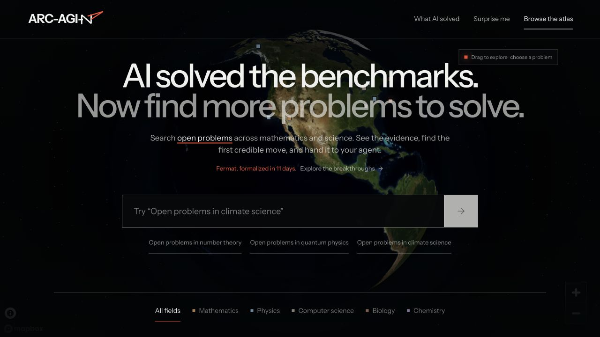
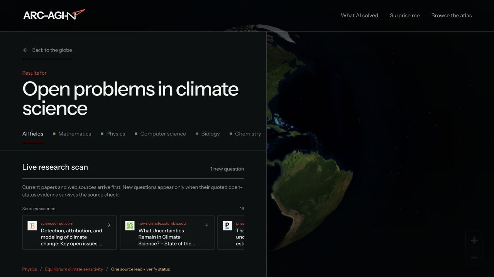
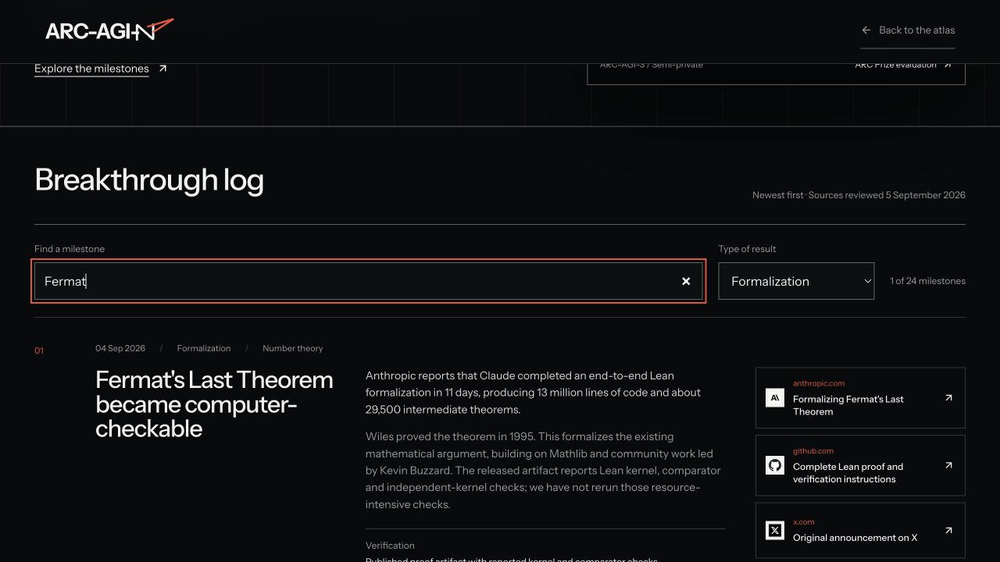

# ARC-AGI-N

**A tool to find more open problems for AI to solve.**

Find open questions in mathematics, physics, computer science and more. Read the papers, copy a prompt, or get a research plan.

Planned home: [arc-agi-n.com](https://arc-agi-n.com) · [MIT license](LICENSE) · [Contributing](CONTRIBUTING.md)



## Run locally

Self-hosting is the default: bring your own keys, run the app and start searching. Search and research usage is billed to your API account.

Requires Node.js 22 or newer, pnpm 10, a [Valyu API key](https://platform.valyu.ai) and a [Mapbox public token](https://account.mapbox.com/access-tokens/).

```bash
git clone https://github.com/yorkeccak/arc-agi-n.git
cd arc-agi-n
pnpm install --frozen-lockfile
cp .env.example .env.local
```

Set these values in `.env.local`:

```env
NEXT_PUBLIC_APP_MODE=self-hosted
NEXT_PUBLIC_SITE_URL=http://localhost:3100
NEXT_PUBLIC_APP_URL=http://localhost:3100
NEXT_PUBLIC_MAPBOX_TOKEN=pk_your_mapbox_public_token
VALYU_API_KEY=your_valyu_api_key
OPENAI_API_KEY=your_openai_api_key
RESEARCH_TOKEN_SECRET=replace_with_a_random_64_character_hex_value
```

Generate the signing secret with `openssl rand -hex 32`, then run:

```bash
pnpm dev
```

Open [localhost:3100](http://localhost:3100). Keep credentials in the ignored `.env.local`, never in source files.

## Why this exists

The benchmarks are getting beaten. Finding the next worthwhile problem should be easier too.

GPT-6 Astra reached **99.9% on ARC-AGI-3 with the Provider Adapter**, and 62.7% under the provider-neutral Standard harness. Those are different evaluations, not interchangeable scores. ARC Prize also makes clear that saturation does not establish AGI. [Official results](https://arcprize.org/blog/astra).

[](https://arcprize.org/blog/astra)

Outside benchmarks, the work is changing:

- **Fermat's Last Theorem, formalized.** The 4 September announcement reports an 11-day Lean formalization, with a public proof artifact. Wiles proved the theorem in 1995; this makes the existing argument computer-checkable. [Research account](https://www.anthropic.com/research/formalizing-fermats-last-theorem) · [Proof repository](https://github.com/anthropics/fermats-last-theorem).
- **New constructions and better bounds.** AlphaEvolve improved results across a collection of mathematical problems, including the 11-dimensional kissing-number lower bound from 592 to 593. [Research account](https://deepmind.google/blog/alphaevolve-a-gemini-powered-coding-agent-for-designing-advanced-algorithms/).
- **More people entering research.** A prompt from non-specialist Liam Price led to an idea that Price, Terence Tao, Jared Lichtman and five coauthors developed into proofs of two Erdős conjectures. The result required substantial mathematical development, not just a prompt. [Paper](https://arxiv.org/abs/2605.00301).

There is no shortage of open questions. They are scattered across papers, personal pages, workshop notes and specialist databases. The hard part is finding one that is still open, understanding what has been tried, and choosing a useful first step.

That is ARC-AGI-N. The name is a joke about what comes after the benchmark. This is an independent project, not an official ARC Prize benchmark or an affiliated evaluation.

## How to use it

1. **Search.** Try “Open problems in climate science” or “Open problems in number theory.” Web and paper sources appear as they arrive.
2. **Pick a problem.** Read the question, what makes it difficult, and a suggested first step. Browse the globe or refine your search.
3. **Copy a prompt.** Give the question, sources and starting instructions to Claude, ChatGPT, Cursor or any other agent.
4. **Get a research plan.** DeepResearch reads the papers, reviews previous attempts and suggests what to try in your first 72 hours.
5. **Check your history.** Open finished reports or check on research still running. Self-hosted history stays on your browser; connected accounts retrieve their recent app research through Valyu.

Reports have a return URL, live status, Markdown and LaTeX rendering, linked citations, copyable code and PDF download. The breakthrough log separates proofs, formalizations, experiments and benchmark results, with sources and verification notes.





### What powers it

[Valyu](https://docs.valyu.ai) provides web and academic search, and long-running research plans through DeepResearch. Live discovery uses a tool-calling model to search, follow up and stream structured problem cards with source links. Mapbox renders the globe. The app is Next.js 16, React 19 and TypeScript, with React Markdown, GFM and KaTeX for reports.

Self-hosting uses your own server-side API key. No sign-in, separate model API key or local database is required.

### What it does not promise

A sourced search result is not a proof that a problem remains open. Records can become stale, papers can be incomplete, and a plausible avenue may already have been tried. Check the primary literature before claiming novelty.

The app suggests first steps and ways to check your work. It does not estimate a probability of solving a conjecture. Globe locations show places connected to a problem's history or research, not who owns it.

## Deploy your own instance

Import your fork into Vercel as a Next.js project, or use another Node.js host. Keep `NEXT_PUBLIC_APP_MODE=self-hosted`, add the same environment values as local setup, and change both app URLs to your HTTPS origin. Restrict the Mapbox token to that origin.

Optional `DEEPRESEARCH_ALERT_EMAIL` enables completion emails. The app displays a signed report URL immediately; keep it private. Protect shared instances with access controls and provider-side spending limits because all requests use your API key.

The optional OAuth mode also keeps search public and bills it to the deployment's API key; only DeepResearch requires sign-in and uses the user's credits. See [Hosting](docs/HOSTING.md) for configuration and [Security](SECURITY.md) before exposing an instance publicly.

## Development

Optional [Vercel Web Analytics](docs/ANALYTICS.md) measures visits and product actions without recording search text, prompts or private report links. It is off by default for self-hosting.

```bash
pnpm lint
pnpm exec tsc --noEmit
pnpm build
pnpm start
```

In a second terminal, run `pnpm test`. The HTTP smoke suite expects a running app on port 3100; set `TEST_BASE_URL` to test another local origin.

```text
src/app/api/                 Search, research and authentication routes
src/app/research/[taskId]/   Research report pages
src/components/             Globe, search, dossiers and report UI
src/lib/problems.ts         Curated problem records
src/lib/breakthroughs.ts    Research milestones and sources
tests/                      HTTP and security-contract smoke tests
docs/RESEARCH.md             Evidence and further reading
```

## Contribute

Add a well-sourced problem, correct an outdated claim, improve an accessible interaction, or contribute a reproducible way to check a result. See [CONTRIBUTING.md](CONTRIBUTING.md) for the workflow and evidence requirements.

Report vulnerabilities privately using the guidance in [SECURITY.md](SECURITY.md). Do not include credentials or private report links in issues.

## License

[MIT](LICENSE). Referenced papers, benchmark figures, logos and other third-party material retain their respective owners' rights.
